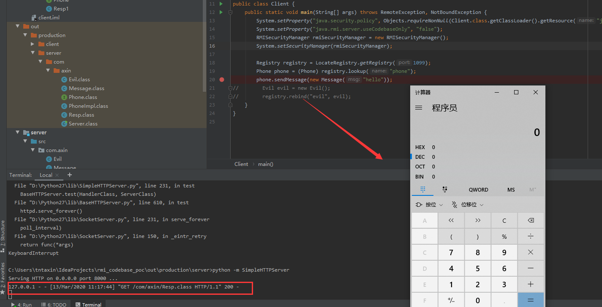

### rmi codebase 动态类加载漏洞利用示例

服务端：

如Server.java中代码所示，服务端主要是绑定了一个phone对象到registry,这个phone对象有一个sendMessage方法
，该方法返回一个Resp对象，而这个Resp类文件在Client端是不存在的，这个时候，如果jdk满足条件（useCodebaseOnly=false），
客户端就会到服务端指定的codebase去加载Resp.class文件，然后利用这个Resp.class文件构建对象（反序列化）。

客户端：

客户端需要满足两个条件，一个是配置了RMISecurityManager,并配置了相应的安全策略，另一个就是设置useCodebaseOnly为false,具体代码实现可以看
Client.java中的实现。

前面说到了客户端会去服务端指定的codebase加载Resp.class，我在服务端配置的codebase代码如下：

由于是本地测试，所以我设置的codebase为 `http://127.0.0.1:8000/`,那么我们在本地需要起一个http服务，

运行Server端后，会在项目路径下生成一个out目录，目录结构如下：

 

我们切换到out/production/server目录下，运行： `python -m SimpleHTTPServer` 起一个简单的http server。

然后再运行Client.java,成功弹出计算器：

注： 我用的jdk版本为jdk7u15